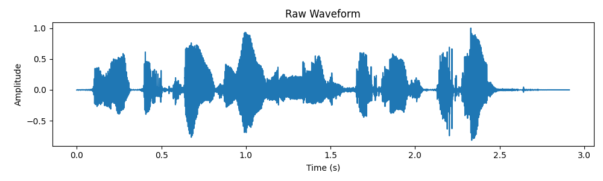
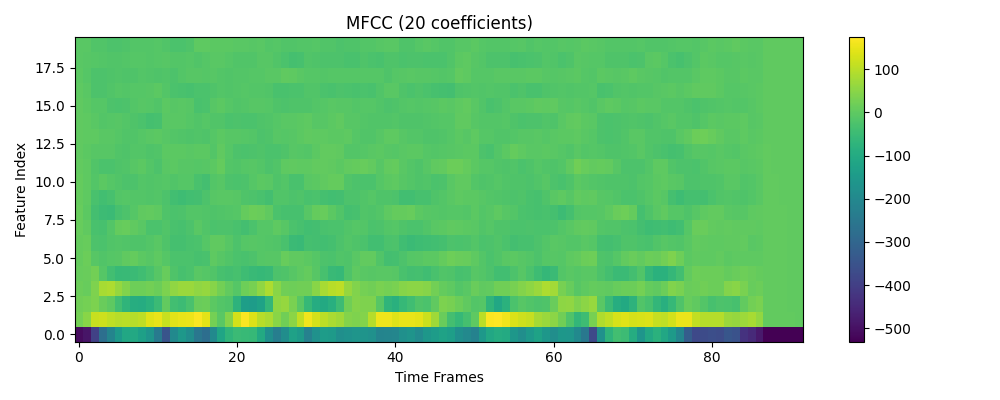
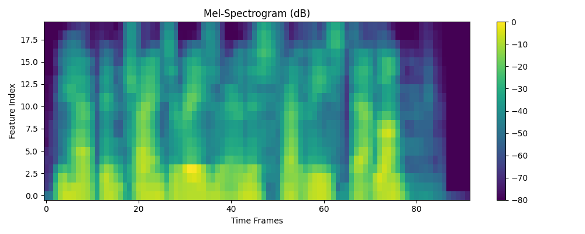
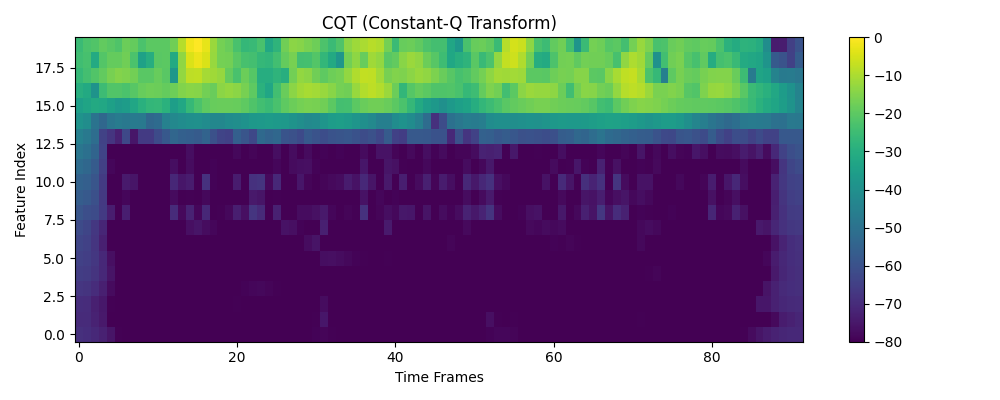

# 🎤 Audio Deepfake Detection using Multi-Feature CNN-BiLSTM

This project implements a deep learning pipeline to detect **audio deepfakes** using multiple acoustic features (MFCC, Mel-Spectrogram, CQT, CQCC) and a custom **multi-branch CNN-BiLSTM** model.

🔥 **Live Demo**:  [](https://audio-deepfake-detection-using-multi-feature-cnn-bilstm-ncvfow.streamlit.app/)

---

## 📂 Dataset

- **Dataset Used**: [ASVspoof 2019 - Logical Access (LA)](https://www.asvspoof.org/index2019.html)
- **Format**: `.flac` audio files
- **Labels**:
  - `bonafide`: genuine speech
  - `spoof`: generated via TTS or voice conversion
- **Splits**:
  - `train` (labeled)
  - `dev` (labeled validation set)
  - `eval` (unlabeled test set)

---

## 🧠 Model Architecture

A multi-branch hybrid model combining convolutional and recurrent layers:

<pre> ``` Raw Audio (.flac) 
↓ +-----------------------------+ |
 Feature Extraction (4x) | 
 | MFCC | Mel | CQT | CQCC | 
 +-----------------------------+ 
 ↓ 
 +-----------------------------+ 
 | 4 separate CNN branches | 
 +-----------------------------+ 
 ↓ 
 Concatenated features 
 ↓ 
 BiLSTM Layer 
 ↓ 
 Fully Connected + Sigmoid 
 ↓ Output: Bonafide / Spoof 
 ``` </pre>


---


## 📊 Feature Visualizations

| Feature       | Preview |
|---------------|---------|
| **Waveform**  |  |
| **MFCC**      |          |
| **Mel**       |            |
| **CQT**       |            |

> CQCC is currently mocked; replaceable with true CQCC extraction (Kaldi or `cqcc-python`).

---

## 🚀 How to Run Locally

### 1. Clone the Repository

```bash
git clone https://github.com/koukuntla-pranav/Audio-Deepfake-Detection-using-Multi-Feature-CNN-BiLSTM.git
cd Audio-Deepfake-Detection-using-Multi-Feature-CNN-BiLSTM
pip install -r requirements.txt
streamlit run app.py
```

### 2. Install Dependencies 
```bash 
pip install -r requirements.txt
```
### 3. Train the model
``` bash
python train.py
```
### 4. Run Prediction 
``` bash
python predict.py --file path/to/audio.flac

```

### 5 . Launch the Streamlit app
``` bash 
streamlit run app.py
```

⚠️ Make sure best_model.pth is available in the models/ folder.
## 📁 File Structure

| File / Folder       | Description                                      |
|---------------------|--------------------------------------------------|
| `app.py`            | Streamlit app UI                                 |
| `model.py`          | MultiFeatureCNN_BiLSTM model definition          |
| `train.py`          | Training & validation loop                       |
| `predict.py`        | Command-line audio prediction                    |
| `utils.py`          | Feature extraction, plotting helpers             |
| `models/`           | Saved PyTorch model (`best_model.pth`)           |
| `plots/`            | Sample waveform + feature visualizations         |


## 📚 Citation

Based on:

<pre> ```bibtex @inproceedings{10.1145/3658664.3659647, title={Detecting Audio Deepfakes: Integrating CNN and BiLSTM with Multi-Feature Concatenation}, author={Wani, Taiba Majid and Qadri, Syed Asif Ahmad and Comminiello, Danilo and Amerini, Irene}, booktitle={Proceedings of the 2024 ACM Workshop on Information Hiding and Multimedia Security}, year={2024} } ``` </pre>


[](https://audio-deepfake-detection-using-multi-feature-cnn-bilstm-ncvfow.streamlit.app/)
